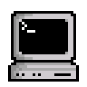

  

# whoami
Junior software developer by trade. Projects here are developed in my free time mostly for myself :)

## Languages
I'm self taught in the below languages:
- JavaScript
- Rust
- Python
- HTML
- CSS
- Markdown
- Bash (POSIX)
- C and C++ (basics)

All languages I have learned either through school or work:
- TypeScript
- Java
- C#
